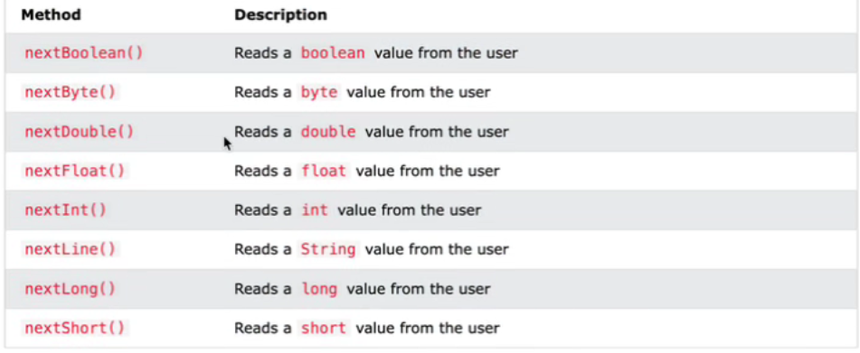
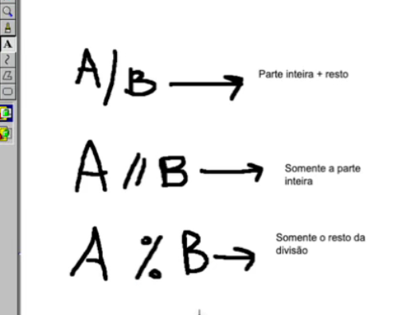

Identar: SELECIONAR TUDO E DAR ALT + SHIFT + F
Printar string + valor de variavel exemplo "System.out.println("X = " + x);"
abrir vscode no terminal "code ."  
USAR , EM INPUTS DE VARIAVEIS

--- 
# Comandos do terminal


Compilar o java: 

```
 javac nomedoarquivo.java
```

Rodar o java: 

```
 java Main
```


Diretório atual: 

```
 pwd
```

Mudar Diretório: 

```
 cd nomedapasta
```

Voltar diretório:

```
 cd..
```




Se precisar mais de uma casa decimal após virgula usar printF ao invés de printIn ex: System.out.printf("SALARY = U$ %.2f\n", real * WH);

# Clonar repositório

Dentro do terminal:

```
git clone https://github.com/Rog1veN/Beecrowd.git
```

Dentro do terminal:

Para adicionar todos os arquivos do diretório raiz

```
git add .
```

```
git commit -m "Mensagem sobre o commit" ex: "Atualiza pacotes"
```

```
git push
```
# Leitura em uma linha
Ler a entrada como string
String input = sc.nextLine();
String[] cadeiaChar = input.split(" ");

# Cast no java (string para int e double)

String variavel = "5";
int numero = Integer.parseInt(variavel);

String sophya = "1.73";
double altura = Double.parseDouble(sophya);

# Cast no java (double para int)

Apenas colocar um int antes 

double totalDias = 450.0;

int anos = (int) (totalDias / 365);

# Tipos de divisões




